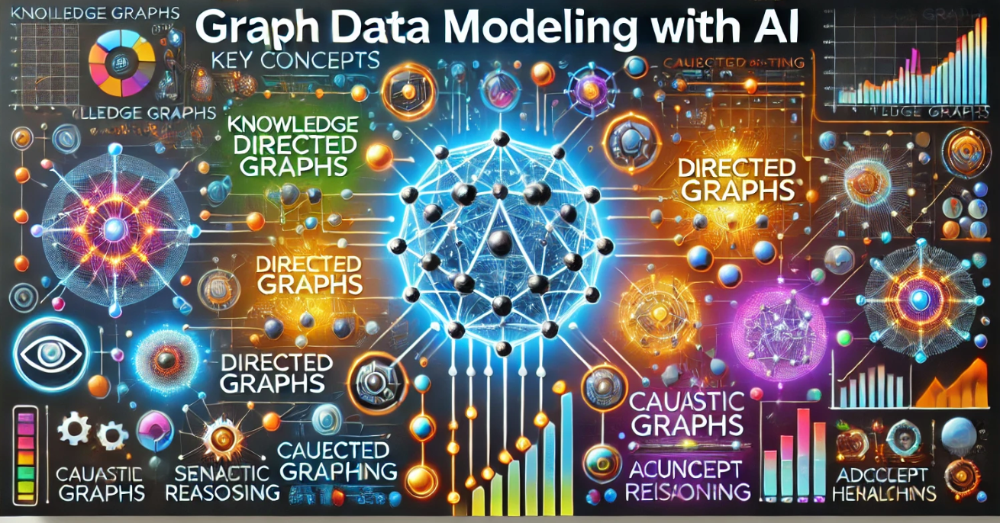

# Graph Data Modeling with AI

[](https://dmccreary.github.io/graph-data-modeling-course/)
[](https://creativecommons.org/licenses/by-nc/4.0/)
[](https://www.mkdocs.org/)

An undergraduate-level course on graph data modeling that explores how graph databases complement large language models (LLMs) to create robust AI systems.



## 🎯 Course Overview

This 14-week course teaches foundational principles and advanced techniques of graph data modeling. Students progress from basic concepts to creating sophisticated domain-specific graph models across various industries.

### Learning Objectives

Upon completion, students will be able to:

- **Remember** key graph modeling concepts (nodes, edges, properties, paths)
- **Understand** graph data models' role in representing real-world systems
- **Apply** graph modeling techniques across diverse domains
- **Analyze** requirements to identify optimal graph structures
- **Evaluate** architectural and performance trade-offs
- **Create** advanced, scalable graph models for dynamic systems

## 📚 Course Content

### Core Topics

- **Foundations**: Graph concepts, ISO GQL, future trends
- **Domain Modeling**: Customer data, products, healthcare, fraud detection
- **Advanced Concepts**: Bitemporal modeling, causality, supply chains
- **AI Integration**: Model evolution, scalability, sustainability

### Interactive Features

- 🎮 **Interactive Visualizations**: Learn through vis.js-powered graph simulations
- 🧠 **Learning Graph**: Explore concept dependencies across 150+ course topics
- 📊 **Domain Templates**: Ready-to-use models for social networks, e-commerce, and more
- 🤖 **AI-Generated Content**: Prompts and examples for creating graph models

## 🚀 Quick Start

### Prerequisites

- Python 3.7+
- Basic understanding of data structures (recommended)

### Installation

```bash
# Clone the repository
git clone https://github.com/dmccreary/graph-data-modeling-course.git
cd graph-data-modeling-course

# Install MkDocs and dependencies
pip install mkdocs mkdocs-material

# Serve the site locally
mkdocs serve
```

Visit `http://127.0.0.1:8000` to view the course materials.

### Building the Site

```bash
# Build static files
mkdocs build

# Deploy to GitHub Pages (maintainers only)
mkdocs gh-deploy
```

## 🛠️ Development

### Utility Scripts

Generate table of contents:
```bash
cd src/gen-toc
python generate-toc.py
```

Convert CSV data to JSON for visualizations:
```bash
cd src/csv-to-json
python csv-to-json.py
```

Sort glossary entries:
```bash
cd src/sort-glossary
python sort-glossary.py
```

### Project Structure

```
├── docs/                    # Course content
│   ├── chapters/           # 27 course chapters
│   ├── sims/               # Interactive simulations
│   ├── prompts/            # AI content generation prompts
│   └── img/                # Images and graphics
├── src/                    # Utility scripts
└── mkdocs.yml              # Site configuration
```

## 🤝 Contributing

We welcome contributions! Here's how to get involved:

1. **Fork** the repository
2. **Create** a feature branch: `git checkout -b feature/amazing-feature`
3. **Make** your changes and test locally
4. **Commit** with clear messages: `git commit -m 'Add amazing feature'`
5. **Push** to your branch: `git push origin feature/amazing-feature`
6. **Submit** a Pull Request

### Contribution Guidelines

- Follow existing markdown formatting conventions
- Test changes with `mkdocs serve` before submitting
- Update relevant documentation
- Ensure all links work correctly
- Add appropriate examples for new concepts

## 👥 Target Audience

- Computer science undergraduates
- Data science students
- Professionals interested in graph databases
- AI/ML practitioners exploring knowledge graphs
- Self-learners seeking structured graph modeling education

## 🏫 Course Structure

**Duration**: 14 weeks  
**Level**: Undergraduate  
**Prerequisites**: None required (basic data structures knowledge helpful)

### Assessment Methods

- Case studies on real-world graph applications
- Hands-on exercises with graph databases
- Group projects for domain-specific models
- Capstone project with comprehensive graph model

## 📖 Resources

- **Course Website**: [Graph Data Modeling](https://dmccreary.github.io/graph-data-modeling-course/)
- **Interactive Learning Graph**: [Concept Dependencies](https://dmccreary.github.io/graph-data-modeling-course/sims/learning-graph/)
- **Author LinkedIn**: [Dan McCreary](https://www.linkedin.com/in/danmccreary/)

## 📄 License

This work is licensed under a [Creative Commons Attribution-NonCommercial 4.0 International License](https://creativecommons.org/licenses/by-nc/4.0/).

See [LICENSE](docs/license.md) for full details.

## 🙋 Support

- **Issues**: Report bugs or request features via [GitHub Issues](https://github.com/dmccreary/graph-data-modeling-course/issues)
- **Questions**: Connect with the author on [LinkedIn](https://www.linkedin.com/in/danmccreary/)
- **Feedback**: Use our [feedback form](https://dmccreary.github.io/graph-data-modeling-course/feedback/) on the course website

---

⭐ **Star this repository** if you find it helpful for learning graph data modeling!