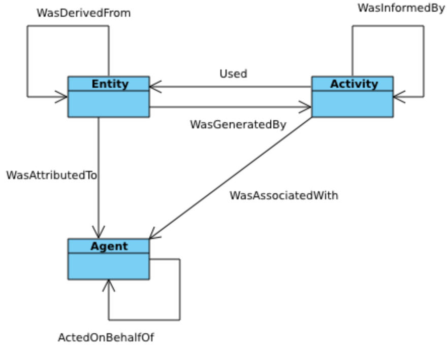

# Modeling Linage

## What is Linage and Provence?

## The Who Did What to an Entity Model

### Entity

An entity is a physical, digital, conceptual, or other kind of thing with some fixed aspects; entities may be real or imaginary.

### Activity

An activity is something that occurs over a period of time and acts upon or with entities.

Activities may include consuming, processing, transforming, modifying, relocating, using, or generating entities. [Detailed specification] Just as entities cover a broad range of notions, activities can cover a broad range of notions: information processing activities may for example move, copy, or duplicate digital entities; physical activities can include driving a car between two locations or printing a book.

### Agent

An agent is something that bears some form of responsibility for an activity taking place, for the existence of an entity, or for another agent's activity. 

## The DM-Prov Reference Model

[W3C DM Prov](https://www.w3.org/TR/2013/REC-prov-dm-20130430/)