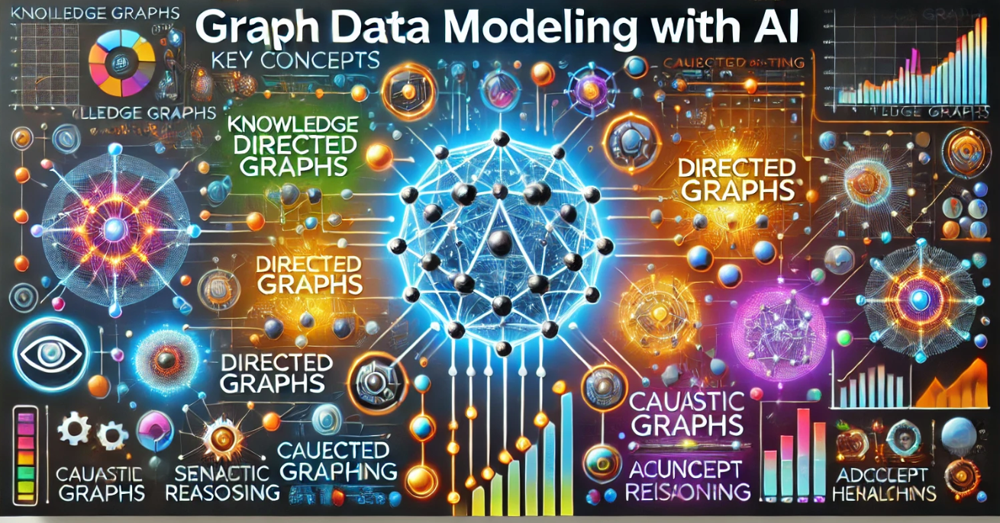

# Graph Data Modeling with AI

Welcome to our website for Graph Data Modeling with AI.

This course is designed as a 10 to 14-week course for undergraduate
computer science students that are interested in graph data
models and how the complement the limitations of [large-language models](./glossary.md#large-langauge-models) (LLMs).

I first started using LLMs to generate educational content in [September of 2020](https://dmccreary.medium.com/using-al-to-generate-detailed-lesson-plans-29a5af200a6a).
At the time, the 1.7 billion parameter GPT-3 was the the largest, most powerful
LLM.  But LLMs improved both in size and quality.  Now, given the right context, they can generate large sections of textbooks.

But they only make predictions of the next word or are used to
convert text into images, video or speech.  They have no models of the real world.
And because of this, they will forever be flawed and prone to hallucination.

That is where this book comes in.  If you have a deep appreciation for graph data modeling you will understand that graph databases can complement LLMs.  Where LLMs are weak, graph databases are strong.  Querying graphs gives precise, reproducible and highly explainable answers.  By combing LLMs with graphs you can create robust AI systems with robust features and far lower costs.

We hope you enjoy learning graph modeling with this book and we look forward to your [feedback](./feedback.md).

Please connect with me on [LinkedIn](https://www.linkedin.com/in/danmccreary/) if you have any questions.

- Dan McCreary

